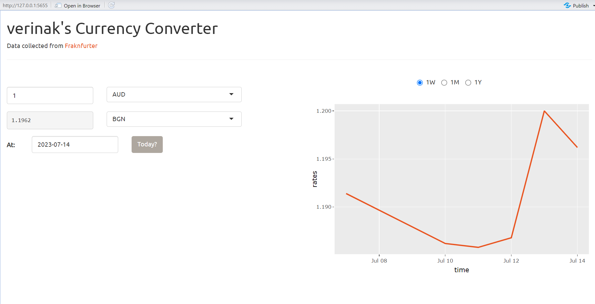
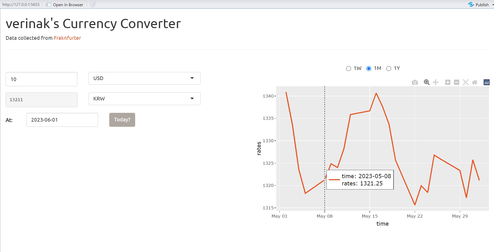

# shiny-currency

## Description
Simple currency converter using R Shiny and [Frankfurter API](https://www.frankfurter.app/), made as a silly app to practice using APIs in R.
  
User can convert from a selected currency to another one, and can specify the amount and the date of conversion. The app also generates a plot representing the change is currency exchange rate with time.
 

